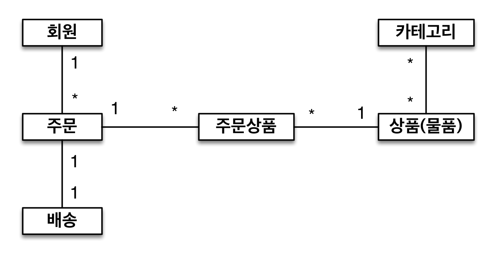
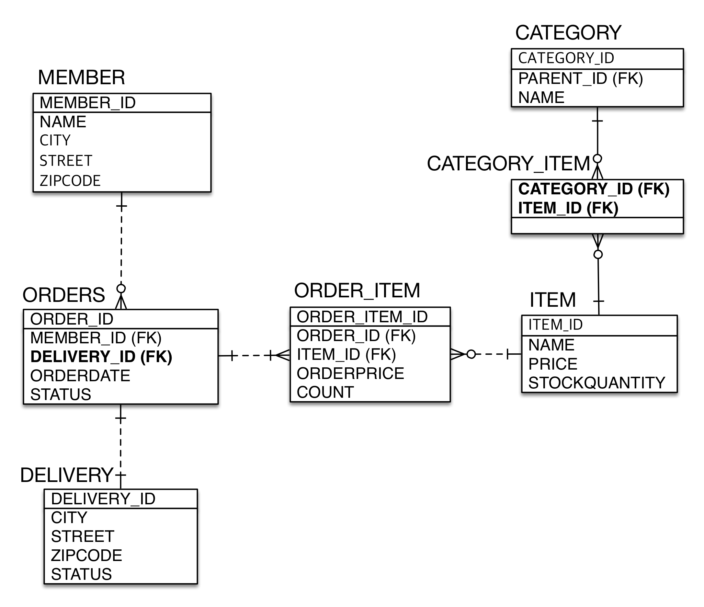

#### 6장. 실전 예제

- Entity

- ERD

- Entity 상세

### 다양한 연간관계 매핑
엔티티 연간관계 매핑할 때 3가지를 고려해야 한다. 
- 다중성
- 단방향, 양방향
- 연간관계의 주인

- 다중성
N:1
1:N
1:1
N:M -> 다대일의 경우 일대다,다대일로 관계는 실무에서 풀어 사용한다.

- 단뱡향, 양방향
데이터 관점에서는 외래 키 하나로 조인을 하여 양방향으로 쿼리 작성이 가능하다. 
객체 관계에서 한 쪽만 참조하는 것을 단방향, 양쪽이 서로 참조하는 것을 양방향 관계라 한다. 

- 연간관계의 주인

복합키를 사용하는 경우 @IdClass를 이용하고 새로운 클래스를 만들어서 복잡도가 높아진다. 
새로운 기본키를 설정하여 실전 에제를 풀이하였다. (CATEGORY_ITEM 엔티티 참조.) 
다대다 관계의 경우를 일대다:다대일 관계로 변경후 풀었다. (ERD 참조) 
